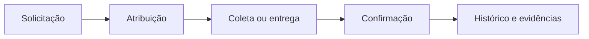

  

# ProtoVia

### Protocolos e rastreabilidade para operações que não podem perder o controle.

A **ProtoVia** centraliza solicitações, entregas, retiradas e vencimentos documentais em uma experiência simples, rastreável e personalizada para cada empresa.

Do pedido inicial à confirmação final, cada etapa preserva responsáveis, datas, documentos e evidências. O resultado é uma operação mais organizada, com menos retrabalho e mais segurança para equipes administrativas, entregadores e gestores.

## Uma operação inteira em um só lugar

- **Protocolos digitais:** vários documentos reunidos na mesma solicitação, com numeração, etiquetas e comprovantes.
- **Entrega rastreável:** confirmação por QR Code ou contingência controlada, assinatura e registro de localização.
- **Retiradas organizadas:** solicitação, coleta e conferência presencial em um fluxo separado e fácil de acompanhar.
- **Prazos sob controle:** painel de vencimentos e alertas antecipados por e-mail.
- **Comunicação automática:** avisos de novas atribuições, coletas e conclusões enviados às pessoas certas.
- **Gestão de acesso:** perfis e permissões adequados às responsabilidades de cada usuário.
- **Histórico operacional:** decisões e movimentações preservadas para consulta e auditoria.

## Feita para carregar a marca do cliente

Cada implantação pode receber nome, logotipo e cores próprios. A identidade da empresa ganha destaque sem apagar a assinatura tecnológica da ProtoVia.

Há diferentes formas de apresentação da marca, permitindo adequar o ambiente ao pacote contratado e ao padrão visual de cada organização.

## Segurança e independência por cliente

Cada cliente opera em uma instalação independente, com banco de dados, domínio, usuários e credenciais exclusivos. Essa separação reduz o risco de mistura de informações e facilita manutenção, evolução e personalização.

A ProtoVia é disponibilizada como um site online, com acesso seguro pelo navegador e uma instalação hospedada e isolada para cada cliente.

## Fluxo simples, evidência completa

O administrador define quais recursos estarão ativos, incluindo retirada documental, confirmação por QR Code, regras de GPS e alternativas de contingência.

## Materiais do produto

- [Apresentação da arquitetura](output/pdf/protovia-arquitetura-software.pdf)
- [Design system](output/pdf/protovia-design-system.pdf)
- [Fluxos operacionais](output/pdf/protovia-fluxogramas.pdf)
- [Arquitetura técnica](docs/ARQUITETURA.md)
- [Segurança e isolamento](docs/SEGURANCA.md)
- [Implantação](docs/IMPLANTACAO.md)

## Licenciamento comercial

A ProtoVia é um produto proprietário disponível para licenciamento empresarial. A implantação, personalização de marca, configuração de módulos e condições de uso são definidas comercialmente para cada cliente.

## Licença

Software proprietário de **Guilherme Andrade dos Santos Trevisan**. A disponibilização deste repositório não torna o produto open source e não concede autorização automática de uso, cópia, alteração, redistribuição ou exploração comercial. Consulte [LICENSE](LICENSE).

**Copyright © 2026 Guilherme Andrade dos Santos Trevisan. Todos os direitos reservados.**
