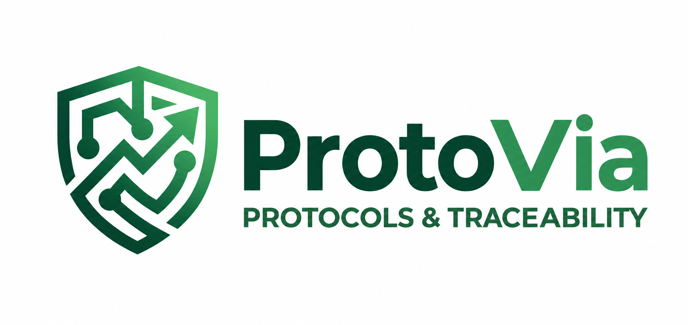
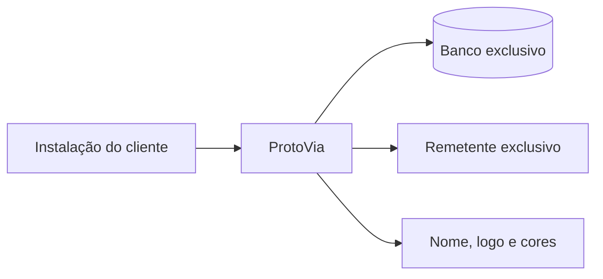

<p align="center">
  
</p>

# ProtoVia

Plataforma de protocolos e rastreabilidade documental preparada para instalações independentes e personalizadas por cliente.

Cada implantação possui banco, usuários, identidade visual, domínio e credenciais próprios. A marca ProtoVia permanece como autoria do produto, enquanto nome, logo e cores do cliente são configurados pelo administrador.

## Recursos

- emissão de protocolos com vários documentos;
- QR Code, assinatura e confirmação manual de contingência;
- etiquetas A4, envelopes e comprovantes;
- empresas, usuários, perfis e histórico operacional;
- alertas de vencimento e notificações por e-mail;
- GPS opcional, obrigatório ou justificado;
- módulo opcional de retirada e conferência documental;
- identidade visual com cores e três modos de apresentação da marca;
- operação hospedada com Vercel/Turso ou local com SQLite.

## Modelo de implantação



O projeto não é multiempresa no mesmo banco. Para cada cliente, crie uma instalação separada.

## Primeira instalação

Requisitos: Node.js 24 ou superior e npm.

```powershell
npm ci
Copy-Item .env.example .env
node -e "console.log(require('node:crypto').randomBytes(32).toString('hex'))"
```

Coloque o segredo gerado em `SETUP_TOKEN`, execute `npm start` e abra `http://127.0.0.1:3000`. O token autoriza somente a criação inicial da organização e do primeiro administrador. Após concluir o cadastro, remova-o do ambiente e reinicie o serviço.

Não existe usuário ou senha padrão.

## Configuração

Variáveis principais:

| Variável | Uso |
| --- | --- |
| `SETUP_TOKEN` | Instalação inicial; remover depois do uso |
| `SQLITE_DATABASE_PATH` | Banco da execução local |
| `TURSO_DATABASE_URL` | Banco da execução hospedada |
| `TURSO_AUTH_TOKEN` | Credencial do banco hospedado |
| `APP_URL` | Endereço público usado nos e-mails |
| `RESEND_API_KEY` | Credencial do serviço de e-mail |
| `EMAIL_FROM` | Remetente autorizado |
| `CRON_SECRET` | Proteção da rotina de vencimentos |

Consulte [.env.example](.env.example).

## Comandos

```powershell
npm start          # servidor local com SQLite
npm run start:cloud
npm test
```

Os testes usam bancos temporários e não enviam e-mails reais.

## Estrutura

```text
public/             interface, identidade visual e PWA
lib/                instalação, dados, e-mail e regras operacionais
banco/schema.sql    esquema inicial sem dados de clientes
tests/              testes automatizados
docs/               arquitetura e operação
server.js           execução local com SQLite
server-turso.js     execução hospedada com Turso
vercel.json         publicação e cron
```

## Documentação

- [Arquitetura de software](docs/ARQUITETURA.md)
- [Fluxos do produto](docs/FLUXOS.md)
- [Design system e identidade](docs/DESIGN-SYSTEM.md)
- [Segurança e isolamento](docs/SEGURANCA.md)
- [Implantação](docs/IMPLANTACAO.md)
- [Retiradas de documentação](docs/retiradas.md)

## Licença

Software proprietário de **Guilherme Andrade dos Santos Trevisan**. O acesso ao repositório não concede licença de uso, cópia, alteração, redistribuição ou exploração comercial. Consulte [LICENSE](LICENSE).

**Copyright © 2026 Guilherme Andrade dos Santos Trevisan. Todos os direitos reservados.**
