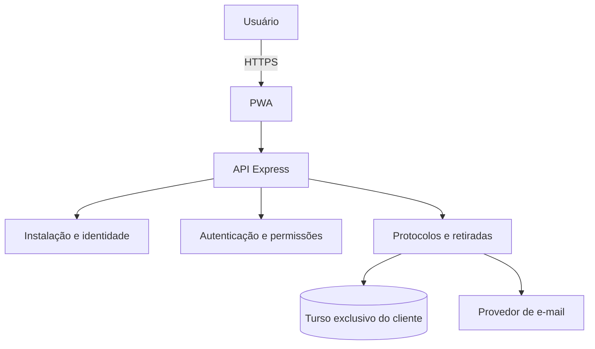
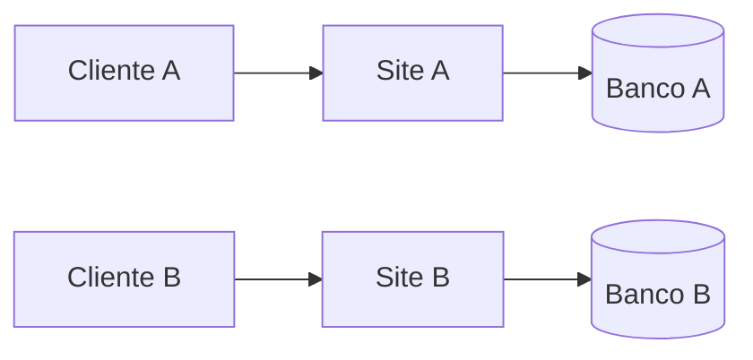

# Arquitetura de software

## Visão geral

A ProtoVia é um site transacional com interface PWA, API Express e persistência exclusiva por instalação. Em produção, cada cliente acessa uma publicação hospedada com banco Turso próprio. SQLite permanece apenas como apoio ao desenvolvimento e aos testes locais.

## Componentes

| Área | Arquivos | Responsabilidade |
| --- | --- | --- |
| Interface | `public/index.html`, `public/theme.css` | navegação, formulários e impressão |
| Identidade | `public/installation.js`, `lib/installation.js` | configuração inicial e marca do cliente |
| Entregas | `public/delivery-settings.js`, `lib/delivery-policy.js` | GPS, QR e contingência |
| Retiradas | `public/pickups.js`, `lib/pickups.js` | solicitação, coleta e conferência |
| E-mail | `lib/email.js` | mensagens transacionais com identidade da instalação |
| Persistência | `lib/database-config.js`, `banco/schema.sql` | conexão e esquema vazio |
| Execução | `server-turso.js`, `vercel.json` | API hospedada, publicação e rotina diária |

## Instalação isolada

Não há seleção de locatário dentro do site. Esse limite reduz o risco de mistura de dados e simplifica backup, restauração e personalização comercial.

## Autorização

- administrador: identidade, configurações, usuários e operações administrativas;
- emissor: criação e acompanhamento de solicitações;
- entregador: entregas e coletas atribuídas;
- Legalização: emissão, entrega/coleta e conferência de retiradas.

As decisões são feitas no servidor. A interface apenas reflete o acesso recebido.

## Evolução do banco

O esquema inicial não contém clientes nem credenciais. O serviço cria estruturas ausentes de forma aditiva. Alterações incompatíveis exigem migração explícita e backup validado.

## Decisões técnicas

- arquivos estáticos reduzem dependências em tempo de execução;
- a operação comercial é publicada exclusivamente como site hospedado;
- `server.js` e SQLite existem somente para desenvolvimento e testes, sem representar uma modalidade do produto;
- regras compartilhadas em `lib/` mantêm o comportamento consistente entre desenvolvimento e produção;
- o service worker melhora disponibilidade, mas não substitui confirmação do servidor;
- personalização visual é aplicada por variáveis CSS, preservando contraste e cores semânticas.
