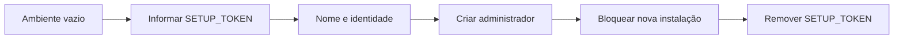
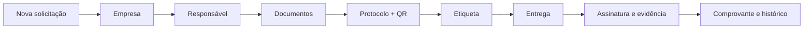
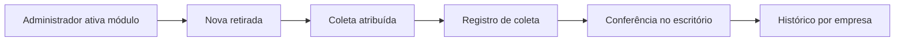
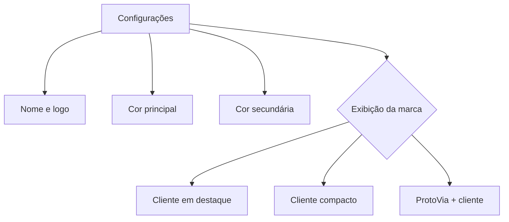
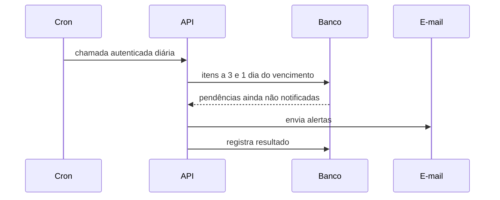

# Fluxos do produto

## Instalação inicial

## Protocolo

## Retirada opcional

A retirada não consome número de protocolo. Desativar o módulo oculta o acesso sem apagar registros.

## Personalização

## Vencimentos

